 
# JBNU-CH 
### An official mobile application of Jeonbuk National University Student Council. The fastest way to access campus notices and welfare. 
ⓒ 2022-2024. Changjin Ha. All Rights Reserved.  

## 🚀 Tech Stack

### Client (Android)
- **Framework:** XML + DataBinding + Fragment
- **Architecture:** Feature-based Modular Structure (Home, Notice, Sports, Rent, etc.)
- **Maps:** Naver Maps SDK for Campus POI (Points of Interest)

### Backend (BaaS & Serverless)
- **Firebase Auth:** Authentication
- **Firebase Firestore:** Real-time data sync for rental items & petitions, notifications, associate stores
- **Firebase Functions:** Serverless business logic for sports matching & push triggers
- **Firebase Messaging (FCM):** Push notifications for council notices
- **Firebase Storage:** Handling image uploads for petitions and notices

## 🏗️ Architecture

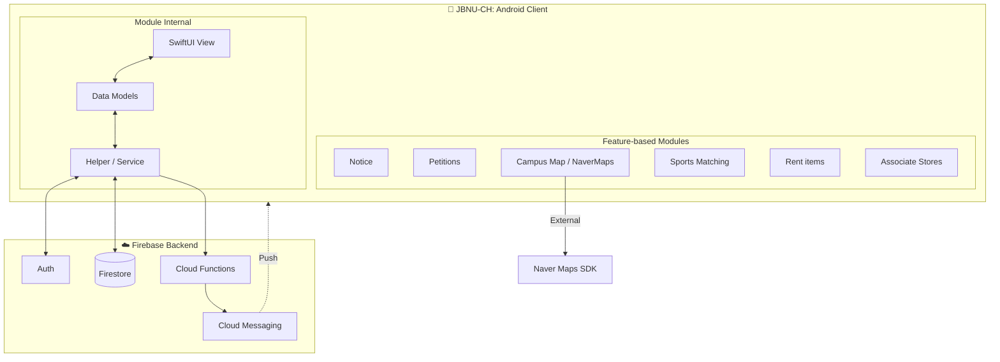
```mermaid
graph TD
    %% Client Modular Structure
    subgraph ClientApp [📱 JBNU-CH: Android Client]
        subgraph ModularDesign [Feature-based Modules]
            Notice[Notice]
            Petitions[Petitions]
            Map[Campus Map / NaverMaps]
            Sports[Sports Matching]
            Rental[Rent items]
            Stores[Associate Stores]
        end
        
        subgraph InternalLayer [Module Internal]
            View[SwiftUI View]
            Model[Data Models]
            Helper[Helper / Service]
        end

        View <--> Model
        Model <--> Helper
    end

    %% Firebase Infrastructure
    subgraph Firebase [☁️ Firebase Backend]
        Auth[Auth]
        FS[(Firestore)]
        Functions[Cloud Functions]
        FCM[Cloud Messaging]
    end

    %% Flow
    Helper <--> Auth
    Helper <--> FS
    Helper --> Functions
    Functions --> FCM
    FCM -.->|Push| ClientApp
    Map -->|External| NMaps[Naver Maps SDK]
```

## 🧱 If I were to rebuild it in 2026

| Layer | Original | 2026 Pick | Reason |
|---|---|---|---|
| UI | XML + DataBinding + Fragment | Jetpack Compose + `LazyColumn` | Eliminates RecyclerView/Adapter boilerplate, live previews, testable |
| Navigation | Manual `FragmentTransaction` | Compose `NavHost` + typed routes | Type-safe routes, back stack handled automatically, deep links trivial |
| State management | `companion object` mutable vars | `ViewModel` + `StateFlow` | Lifecycle-aware, reactive UI updates, testable |
| Async | Firebase callbacks | Coroutines + `suspend` + `await()` | Flat readable code, structured cancellation |
| ML | `firebase-ml-vision` (deprecated) | `com.google.mlkit:text-recognition` | Direct successor, Firebase-independent |
| Image loading | Glide 4.11.0 | Coil 3.x (Compose-native) | Compose-native, coroutine-first, half the binary footprint |
| Bottom nav | JitPack `SmoothBottomBar` | Material 3 `NavigationBar` | First-party, no JitPack dependency, guaranteed maintenance |
| PDF viewer | `android-pdf-viewer` (archived) | `androidx.pdf` (Jetpack, stable 2024) | Official Jetpack library, actively maintained |
| DI | None (manual instantiation) | Hilt | Standard Android DI, integrates with ViewModel/Compose |
| Build | `buildscript {}` + KAPT | `plugins {}` + version catalog + KSP only | Faster builds, centralized version management |

## ✨ Core Features 

    
Show Contents

### Home 
> Check out the features you use often and the latest news on one screen. 

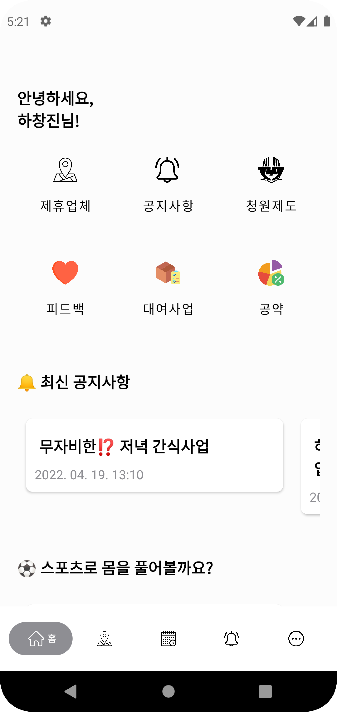 

### Associate Stores 
> List of affiliates, location, benefits, representative menus, and everything from one touch to the phone. 

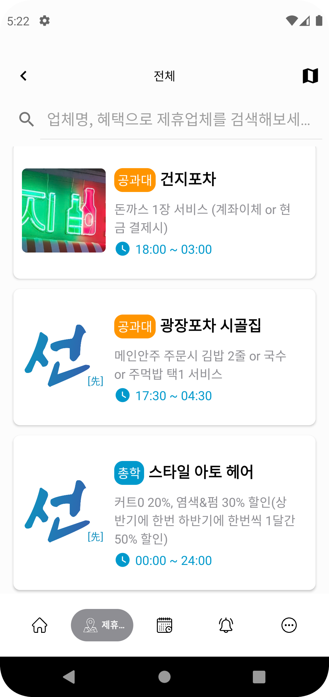
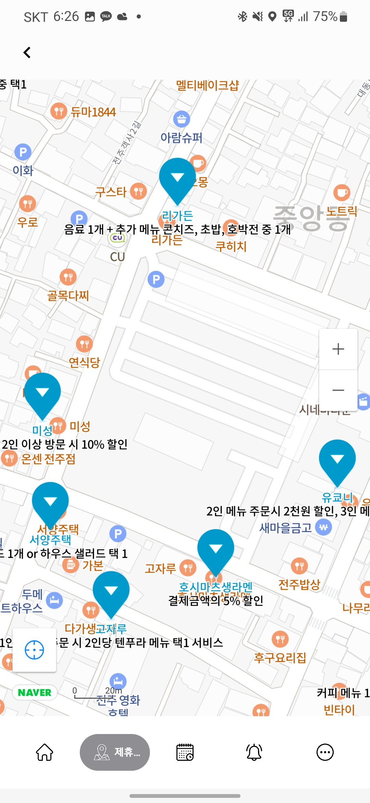
 

### Notice 
> The quickest way to check student council announcements 

 

### JBNU Petitions 
> Revised school regulations that Shape university regulations with your own hands. 

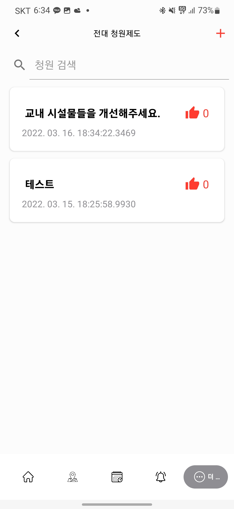 

### Remaining quantity of rental items 
> Even if you don't come to the student council room, check the items and rental records at a glance in real time 

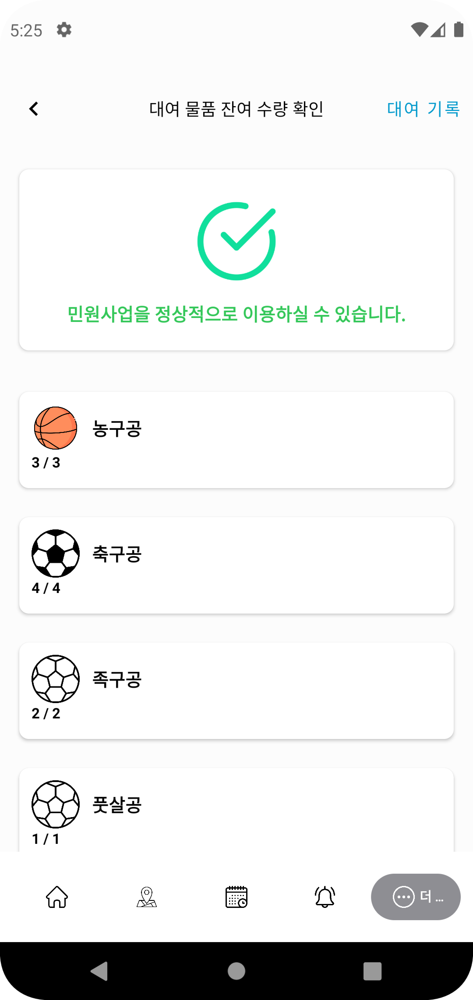 

### Campus Map 
> Never get lost on campus again. 

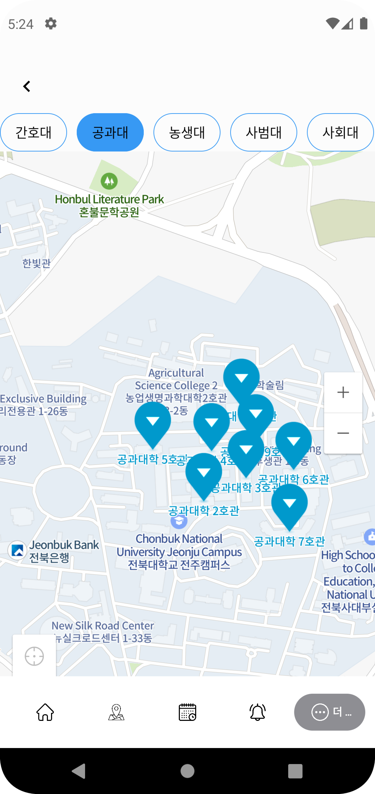 

### Sports mercenary system 
> Looking for someone to work out with anytime, anywhere 

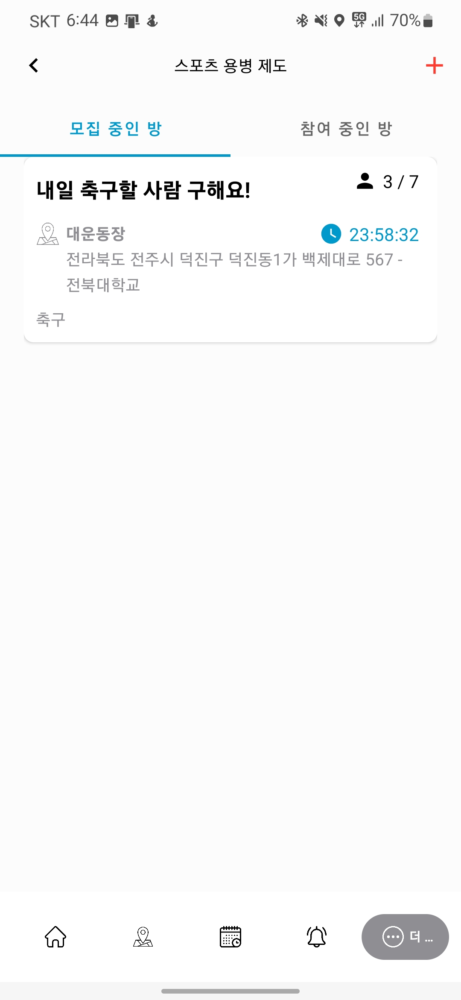
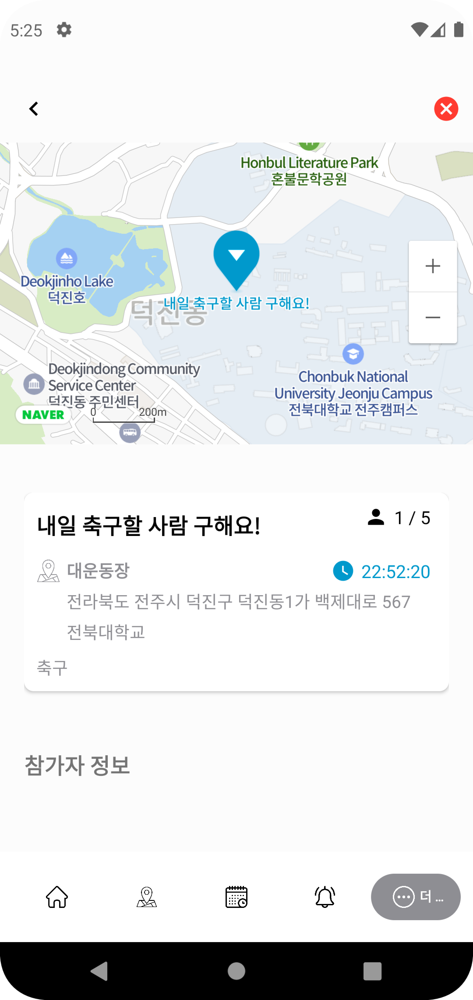 

### HandWriting 
> A peek at the successful candidate's secret 

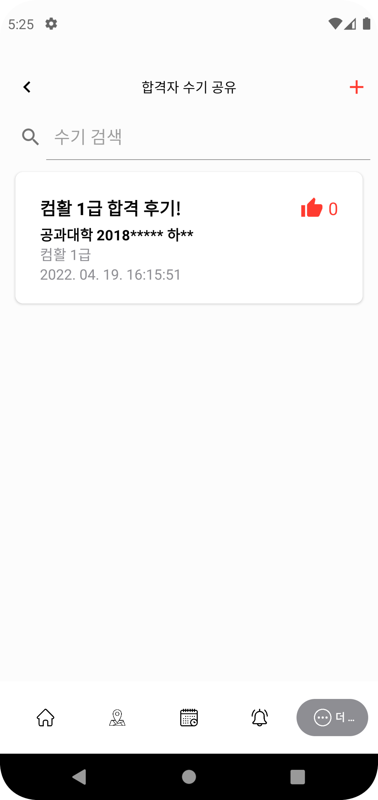 

### Real-time pledge fulfillment rate 
> Student council's promise fulfillment rate in real time 

 

### Feedback Hub 
> From school facilities to apps, now make it with your ideas 

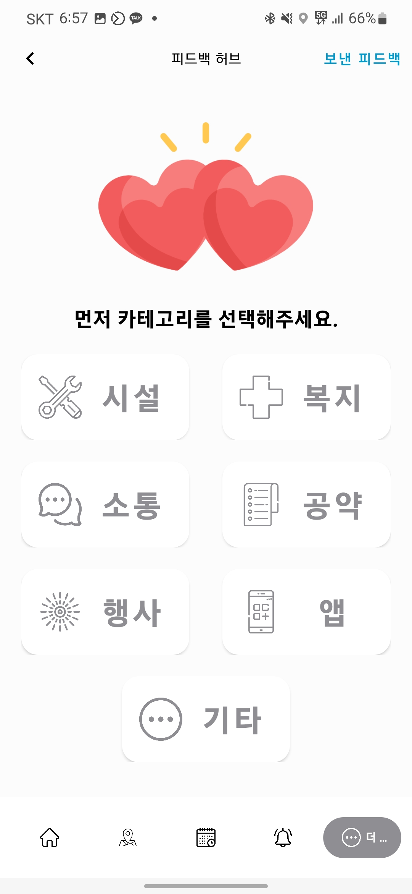
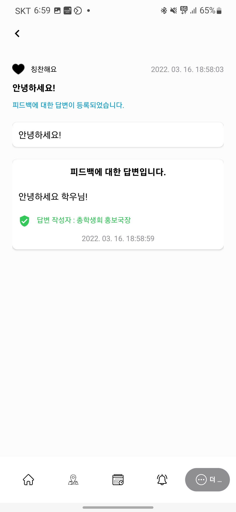 

* Required Android 8.0 or up.  
* 500MB or higher storage required for install application.

